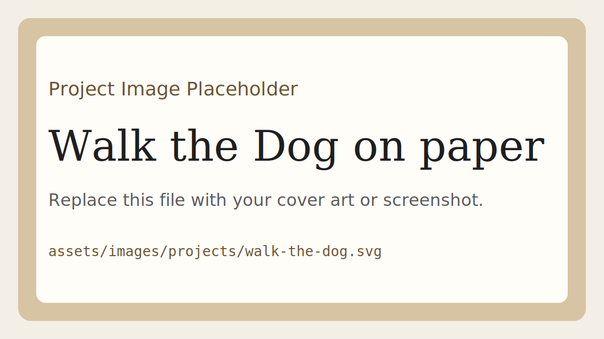
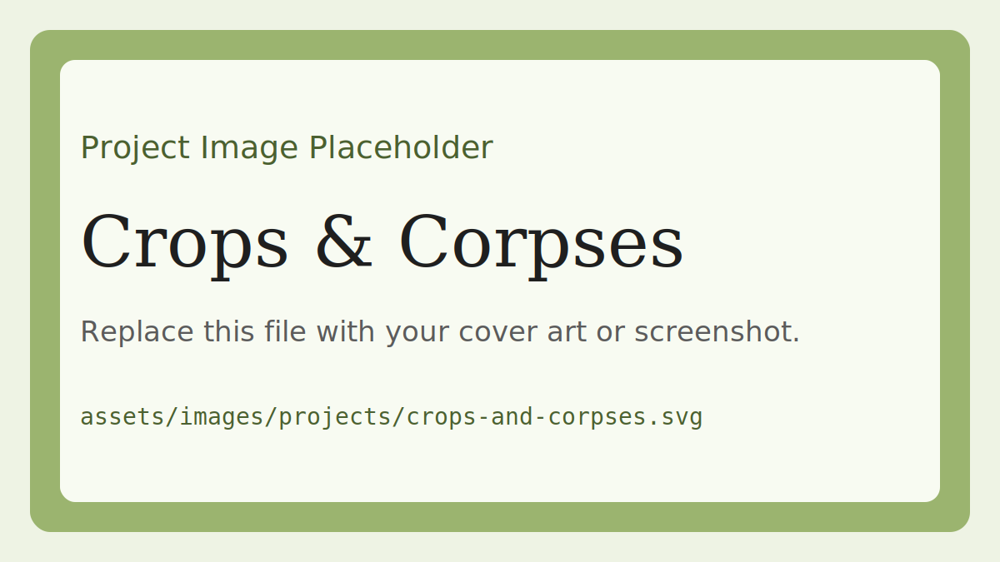
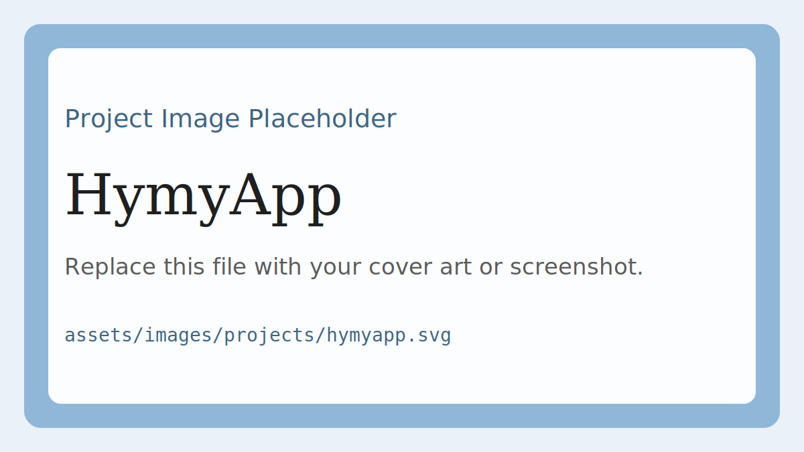

Recent engineering graduate specializing in game development with Unity and C#.

## Projects

### Walk the Dog on paper

Paper prototype project. Replace this placeholder with a cover image or screenshot at `assets/images/projects/walk-the-dog.svg`.

### Crops & Corpses

Game project. Replace this placeholder with a cover image or screenshot at `assets/images/projects/crops-and-corpses.svg`.

### HymyApp

Application project. Replace this placeholder with a cover image or screenshot at `assets/images/projects/hymyapp.svg`.

## CV
[Download CV](./assets/resume/Daniel_Heugenhauser_CV.pdf)

## Contact
- [GitHub](https://github.com/yourusername)
- [LinkedIn](https://linkedin.com/in/yourname)
- [Email](mailto:you@example.com)
